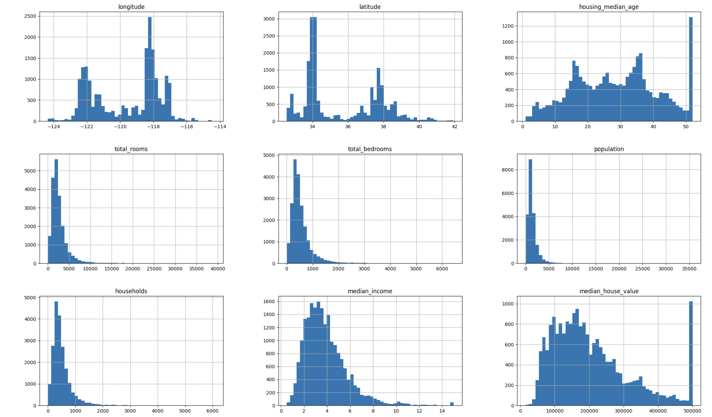

# Housing Price Prediction
This project involves building a housing price prediction model using TensorFlow based on historical housing data from California. 
The goal is to predict housing prices by leveraging various machine learning techniques and neural networks.

## Techniques Used
In this project the following techniques were used: 
- Feature Engineering
- Data Processing
- Data Visualization
- Data Analysis
- Prediction Neural Network

## Tools Used 
- pandas
- numpy
- seaborn
- matplotlib.pyplot
- tensorflow with keras 
- sklearn train_test_split
- python
  
## 1.) Data Extraction 
- Downloaded the data set locally
- and imported the data using pandas

## 2.) EDA (Exploratory Data Analysis)
- Performed operations:
    * info(), describe(), value_counts()
    * isnull().sum()
    * And plotted a histogram for each non categorical feature to view its distribution 
    * Decided to remove rows for all null cells
    * Checked for duplicate rows
 
      
### Conclusions
- Our "median_house_value" and "housing_median_age" appear to be capped at a limit, shown by the large spike/maximum towards the far right of the histogram
  * Two Solutions:
  *   * Either gather more data from districts that were capped
  *   * Or we can remove those pieces of data from the training set
  * It also appears that the "median_income" column is not scaled normally
  * Its also important to note that many histograms represent a tail heavy distribution
      
## 3.) Data Processing 
- We one hot encoded categorical feature ocean_proximity( we had to turn this into integer values due to tensorflows built in one hot encoder not taking categorical values, later I learned just to use pd.get_dummies or sklearn.OneHotEncoder)
- Created feaures: 
  * Total rooms per Household
  * Total bedrooms per Household
  * Population per Household
